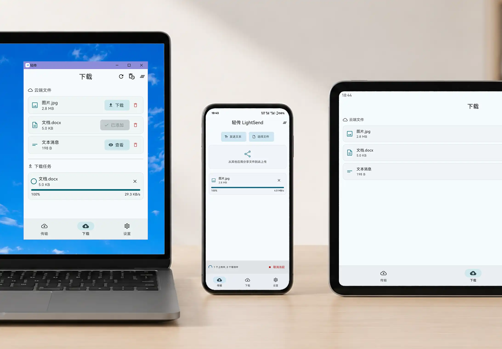
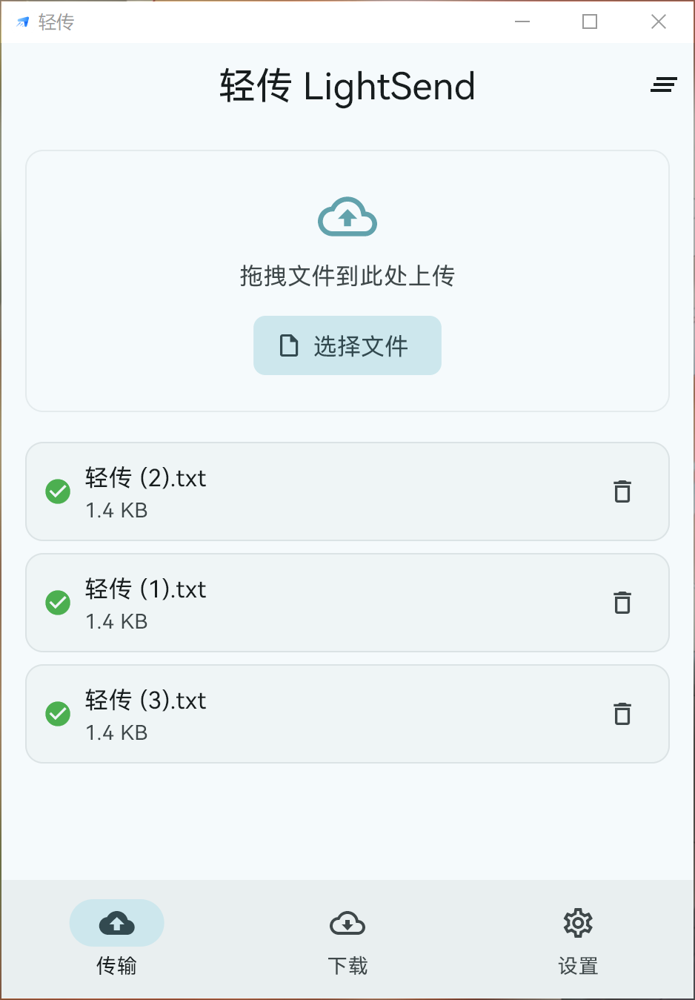
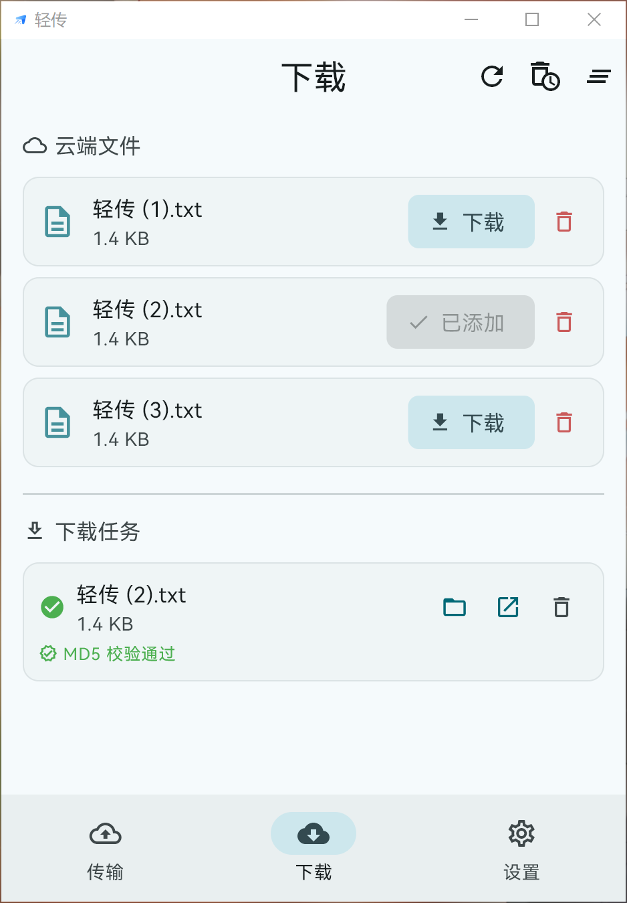
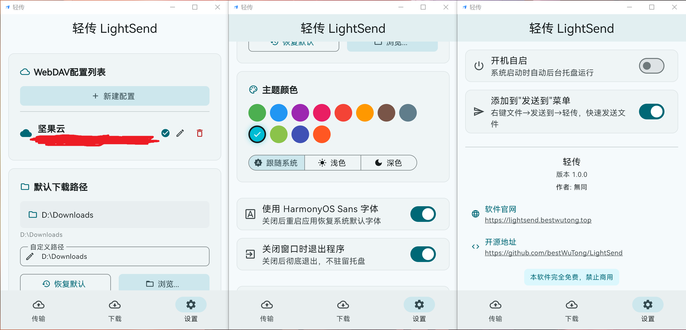

# 轻传 (LightSend)

&gt; 基于 WebDAV 的轻量化跨平台文件传输工具



---

## 项目官网
[lightsend.bestwutong.top](https://lightsend.bestwutong.top/)

## 项目简介

轻传是一款基于 Flutter 开发的跨平台文件传输工具，利用 WebDAV 协议实现文件在不同设备之间的快速传输。无论是在桌面端还是移动端，轻传都能为您提供便捷的文件传输体验。

（软件功能是基于我的个人需求而设计，目前仅支持通过WebDAV进行文件传输，如果希望使用基于局域网的文件传输功能，请使用这款更优秀的产品：[LocalSend](https://github.com/localsend/localsend)）

## 功能特点

- **跨平台支持** - 当前支持 Windows 和 Android（因为我只有这两种设备🌚），在不同设备间自由传输
- **基于 WebDAV** - 使用标准 WebDAV 协议，安全可靠，兼容性强
- **优雅界面** - 现代化的设计风格，支持自定义主题颜色
- **快速分享** - 桌面端支持右键文件选择发送到轻传
- **拖拽上传** - 桌面端支持拖拽文件到应用即可上传
- **多配置管理** - 支持配置多个 WebDAV 服务器配置文件
- **发送文本** - 新增发送文本功能，直接在软件中复制粘贴文本，不用手动新建txt文件

## 应用截图

| 文件上传 | 文件下载 | 设置页面 |
|---------|---------|---------|
|  |  |  |

## 下载使用

### 下载方式

| 方式 | 地址 |
|-----|-----|
| **网盘下载** | [蓝奏云](https://rslamp.lanzouw.com/b0j1g39qf) (密码: wutong) |
| **GitHub Releases** | [查看发布](https://github.com/bestWuTong/LightSend/releases) |

## 技术栈

- **框架**: Flutter 3.11.5
- **状态管理**: flutter_riverpod
- **WebDAV 客户端**: webdav_client + dio
- **本地存储**: shared_preferences
- **桌面端支持**: tray_manager, window_manager
- **构建工具**: CMake (Windows), Gradle (Android)

## 构建指南

### 前置要求

- Flutter SDK &gt;= 3.11.5
- Dart SDK &gt;= 3.11.5
- 对应平台的开发环境（如 Visual Studio, Android Studio 等）

### 克隆项目

```bash
git clone https://github.com/bestWuTong/LightSend.git
cd LightSend
```

### 安装依赖

```bash
flutter pub get
```

### 运行项目

```bash
# Windows
flutter run -d windows

# Android
flutter run -d android
```

### 构建发布版本

```bash
# Windows
flutter build windows

# Android
flutter build apk --release
```

## 开发者

**無同**

- 个人主页: [bestwutong.top](https://www.bestwutong.top/)
- GitHub: [bestWuTong](https://github.com/bestWuTong)

## 许可证

本项目采用 MIT 许可证 - 详见 [LICENSE](LICENSE) 文件

## 问题反馈

如有问题或建议，欢迎提交 [Issue](https://github.com/bestWuTong/LightSend/issues) 或 PR！

---

&gt; ✨ 如果这个项目对你有帮助，欢迎给个 Star ⭐ 支持一下！
